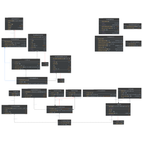

# Search Engines (SE) - LongEval CLEF 2023

---

## Objective
The objective of this repository is to propose an information retrieval system that can effectively handle changes over time, specifically focusing on the temporal evolution of Web documents. The proposed system aims to adapt to the dynamic nature of the web by considering evolving document and query sets. To accomplish this, we leverage the [Longeval](https://clef-longeval.github.io/tasks/) Websearch collection, a comprehensive dataset provided by Qwant, a commercial search engine. This collection encompasses a diverse corpus of web pages, user queries, and user interactions, allowing us to capture and reflect the changes in the web landscape.

This repository is developed for the [Search Engines](https://iiia.dei.unipd.it/education/search-engines/) course.

This repository is carried out by groups of students and consists of participating in one of the labs organized yearly by [CLEF](https://www.clef-initiative.eu/) (Conference and Labs of the Evaluation Forum).

---

## Group Members
CLOSE (Clef LOngeval Search Engine) Group

| Surname         | Name         | ID        |
| --------------- | ------------ | --------- |
| Antolini        | Gianluca     | 2080960   |
| Boscolo Cegion  | Nicola       | 2074285   |
| Cazzaro         | Mirco        | 2076745   |
| Martinelli      | Marco        | 2087646   |
| Safavi          | Seyedreza    | 2071558   |
| Shami           | Farzad       | 2090160   |

---

## Project Description
Our approach involves using the training data provided by Qwant search engine, which includes user searches and web documents in both French and English. We believe that this data will enable our system to better adapt to changes in user search behavior and the content of web documents.

### Organization of the Repository
The project is developed mainly in Java, with the addition of some Python scripts for performing the expansion of the queries and for the re-ranking of the retrieved documents for each topic. The overall structure is as follows:

* `code`: This folder contains the source code of the developed system.
* `runs`: This folder contains the runs produced by the developed system.
* `results`: This folder contains the performance scores of the runs.
* `homework-1`: This folder contains the report describing the techniques applied and insights gained.
* `homework-2`: This folder contains the final paper submitted to CLEF.
* `slides`: This folder contains the slides used for presenting the conducted project.

---

### Class Diagram




The class diagram of the system retraces the Y model of an information retrieval (IR) system. The main components of the diagram include an indexer class, a searcher class, and a main class called "CloseSearchEngine."

The "Analyzer" class is instantiated at the beginning and is used by both the indexer and the searcher. It plays a crucial role in token analysis, including tasks such as tokenization, stemming, and NLP filters.

The parsing section of the system is represented by the "Indexer" component. As it walks through the file tree, the Indexer uses this component to generate Java objects (ParsedTextDocument) from JSON documents, representing them with their fields.

The "Searcher" class handles query parsing from the TREC format using the "ClefQueryParser" class, creating Lucene QualityQuery objects. Additionally, the Searcher instantiates the "ReRanker" responsible for the second-ranking phase.

The class diagram also includes other utility classes that were part of the project but are no longer used.

Note: The image provided above displays the class diagram for reference.

## System Hardware

For the most time during the development of the system, every member of the group ran the model on their own system. It was after implementing the deep learning techniques that we decided to switch and start running the tasks using GPUs to improve time performances.

The following are the specifics of the machines used after switching to computing also with GPU:

### Machine 1:
- CPU: Intel® Core™ i9-12900H 12th generation
- GPU: NVIDIA RTX™ A 2000 4GB GDDR6
- RAM: 16 GB SO-DIMM DDR5 4800MHz
- SSD: 512 GB M.2 2280 PCIe Gen4 TLC Opal

### Machine 2:
- CPU: Ryzen 7 1700 overclocked at 3.8GHz
- GPU: RTX 3070 TI 8GB GDDR6X
- RAM: 16GB DDR4 3000MHz
- SSD: Samsung Evo 970 250GB

---

## How to Run and Use the

Codes

Before any attempt, make sure you have the **collection** and **topics** files available in your system. If you want to use the query expansion, put your open-api key in the python script and run it. The script will create a file named "result.json" which will be used by the searcher. If you want to use the Re-ranking method, you should run it on a system that supports `pytorch cuda` version. Please note that it is not supported on the `macOS system with Apple Silicon chip`. Pass the [sbert](https://huggingface.co/sentence-transformers) model to the searcher. If your model exists in `dl4j`, it will automatically download it. Otherwise, you should download it, convert it to `torch-script`, and put it somewhere, using the path in the `re-ranker` class.

### Running using CLI
We provide here in the folder `final_jar_executable` a jar executable version of our program that automatically creates its own working environment and changes the parameters based on your needs in `CloseSearchEngine.java`. To run it, follow these steps:

1. Open the command line and change directory to where the project folder is located.
2. Build the project by running the `mvn clean install` command.
3. Run the following command, passing the correct parameters:
```
java -jar close-1.00-jar-with-dependencies.jar <collection path> <topic path> <index path>
```

---

*Search Engines* is a course of the

* [Master Degree in Computer Engineering](https://degrees.dei.unipd.it/master-degrees/computer-engineering/) of the [Department of Information Engineering](https://www.dei.unipd.it/en/), [University of Padua](https://www.unipd.it/en/), Italy.
* [Master Degree in Data Science](https://datascience.math.unipd.it/) of the [Department of Mathematics "Tullio Levi-Civita"](https://www.math.unipd.it/en/), [University of Padua](https://www.unipd.it/en/), Italy.

*Search Engines* is part of the teaching activities of the [Intelligent Interactive Information Access (IIIA) Hub](http://iiia.dei.unipd.it/).

---

### License

All the contents of this repository are shared using the [Creative Commons Attribution-ShareAlike 4.0 International License](http://creativecommons.org/licenses/by-sa/4.0/).

